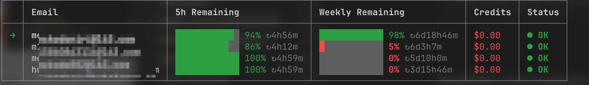

# @kodo/agent-meter

CLI tool for managing multiple Codex OAuth accounts and checking their rate limits / usage.



## Install

```bash
npm install -g @kodo/agent-meter
```

Or run directly with npx:

```bash
npx -y @kodo/agent-meter@latest list
```

If you do not install globally, replace `agent-meter` in the examples below with `npx -y @kodo/agent-meter@latest`.

## Usage

```bash
# Add a new account (opens browser for OAuth login, then auto-checks usage)
agent-meter add

# List all accounts with real-time usage check
agent-meter list

# Show the default account and the shell's effective auth state
agent-meter current

# Switch the default Codex account for the current shell
eval "$(agent-meter use <email-or-id>)"

# Launch Codex directly with a selected account
agent-meter codex <email-or-id>

# Diagnose why switching is not taking effect
agent-meter doctor [email-or-id]

# Remove an account by email
agent-meter delete <email>
```

## How it works

- `add` creates an isolated `CODEX_HOME` directory, runs `codex login`, then immediately checks usage
- `list` concurrently checks all accounts via the OAuth usage API and displays a table with progress bars
- `current` shows the default account, the shell's effective auth source, and whether environment variables are overriding `CODEX_HOME`
- `use` changes the default account and prints shell code that unsets conflicting OpenAI env vars and exports `CODEX_HOME=...`; to affect the current shell, wrap it with `eval "$( ... )"`
- `codex` launches a new Codex CLI process with the selected account, so you can switch accounts without shell `eval`
- `doctor` diagnoses why switching may not be taking effect and prints copy-paste fixes
- `use` only affects new Codex CLI processes; restart any running `codex` session after switching
- `delete` removes the account and its `CODEX_HOME` directory
- If a token expires during `list`, you'll be prompted to re-login on the spot

## Troubleshooting

```bash
# Diagnose the current shell
agent-meter doctor

# Diagnose a specific target account
agent-meter doctor huangzheyu@bytedance.com
```

## Prerequisites

- [Codex CLI](https://github.com/openai/codex) installed and available on PATH

## Options

| Flag | Description |
|------|-------------|
| `--json` | Output raw JSON |
| `--verbose` | Enable verbose logging |
| `--data-dir <path>` | Override the default `~/.agent-meter` directory |

## License

MIT
